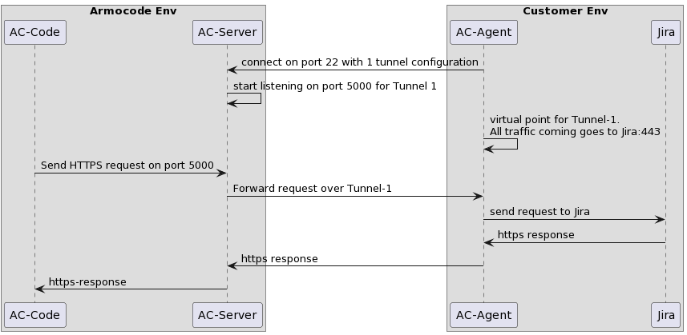

## How it works
Armorcode Agent uses the concept of Reverse SSH tunneling to establish connectivity from Armorcode Platform to customer's on-prem tools/services.

This is a very common technique with many articles available on internet on how it works. Below is a short explaintation of the same.

Lets assume, customer is running JIRA service in internal network and Armorcode has to connect to this JIRA service via Armorcode Agent. It requires following steps

1) Customer starts the Agent in their on-prem enviornment from where JIRA service is reachable.
    a) It uses a configuration to create a reverse tunnel on port 5000 

2) Agent creates a TCP connection to port 22 of Armorcode Server (SSH connection)

3) Due to reverse tunnel configuration, port 5000 opens-up for listening on the Armorcode Server and any traffic sent to this port will reach the JIRA service in customer enviornment.

4) Armorcode platform now initiates connection to customer's JIRA service by making a connection to this port 5000

Same is illustrated with a sequence diagram 

<h1 align="left">
  </a>
  <br>
</h1>


## Setting up the Agent
1. Clone this repo

2. Generate Certificate:
```
openssl genrsa -out private-key.pem 2048  
chmod 400 private-key.pem  
ssh-keygen -y -f private-key.pem > public-key.pem  
```

3. Share public-key.pem with Armorcode support.  
  
4. Share list of on-prem servers (DNS or IP) and their ports which will be accessed by Armorcode via the Agent  
  
5. Get supervisord.conf from Armorcode support  
  
6. Copy supervisord.conf AND private-key.pem to the folder where docker-compose.yml file of this repo is present present  
  
7. Call docker compose up  
    - Also see run.sh to clean-up previous docker image before starting new one
