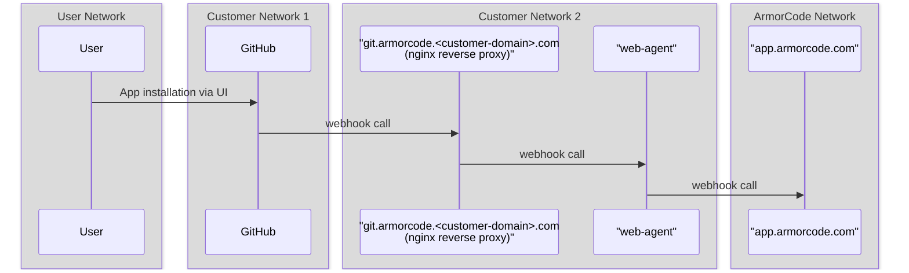

1. Start web-agent in a network which can access app.armorcode.com and the ON-prem Github. Readme for web-agent https://github.com/armor-code/agent/tree/main/web-agent
2. Add web-agent config from UI for github url in Armorcode Agent page
3. Test web-agent working
4. Start Nginx in another/same VM in the same network where web-agent i.e. app.armorcode.com and the ON-prem Github are accessible
5. (Optional)  Put a domain like git.armorcode.paypal.com in Github app and this resolves to nginx
6. Add Nginx config like below
7. Test nginx config from localhost
8. Now while setting up Github app replace in Webhook Url "https://app.armorcode.ai" with "https://git.armorcode.paypal.com" (Or any other domain that is used)