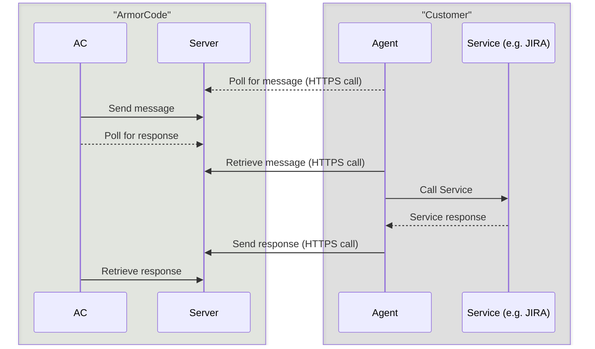

## How it works




## Setting up the Agent with Docker
This is a docker image which can run on any OS supporting docker containers.

1. Generate apiKey from Armorcode Platform
2. Download the latest Agent Image
```commandline
docker pull armorcode/armorcode-web-agent
```
3. Get Server Url of the Armorcode
4. Create a folder/volume to store Api logs
5. Run the docker Image as
```commandline
docker run -d -e server_url='<server_url>' -e api_key='<api_key>'  -v <folder/volume>:/tmp/armorcode armorcode/armorcode-web-agent
```
6. If you don't want to do certificates validations (needed in case if VM don't have any certificates assigned and making https request) pass env variable
```commandline
docker run -d -e server_url='<server_url>' -e api_key='<api_key>' -e verify=False  -v <folder/volume>:/tmp/armorcode armorcode/armorcode-web-agent
```
7. If you have HTTP/HTTPS proxy configs enabled in the VM, those configs should be passed to docker container via env variables . ex ##
```commandline
docker run -d -e server_url='<server_url>' -e api_key='<api_key>' -e verify=False -e HTTP_PROXY=<http_proxy_url>  -e HTTPS_PROXY=<https_proxy_url>  -v <folder/volume>:/tmp/armorcode armorcode/armorcode-web-agent
```


## Setting up the Agent just using the Agent Script 
Steps for customer
1. install requirements:  
   ```commandline
   wget -O requirements.txt 'https://raw.githubusercontent.com/armor-code/agent/refs/heads/main/web-agent/requirements.txt'; pip3 install -r requirements. txt
   ```
2. Download the script:
   ```commandline
   wget -O worker.py 'https://raw.githubusercontent.com/armor-code/agent/refs/heads/main/web-agent/app/worker.py'
   ```

3. Run command: 
   ```commandline
   python3 worker.py --serverUrl 'https://app.armorcode.com' --apiKey `<apiKey>` --index 0 --timeout 25 --verify False
    ```
4. If to make external call to Armorcode server proxy server is needed then pass these values in command line arguments
   ```commandline
   --outgoingProxyHttps <https_proxy> --outgoingProxyHttp <http_proxy> 
   ```
   Note: Both are optional , if not provided agent will use the default proxy in the VM (values present in $HTTP_PROXY environment variable)
5. If to make internal calls to tools/services proxy is needed, then pass these values in command line arguments
   ```commandline
   --inwardProxyHttps <https_proxy> --inwardProxyHttp <http_proxy>
   ```

5. Check logs: 
    ```commandline
    cd /tmp/armorcode/log ; tail -F *
   ```
