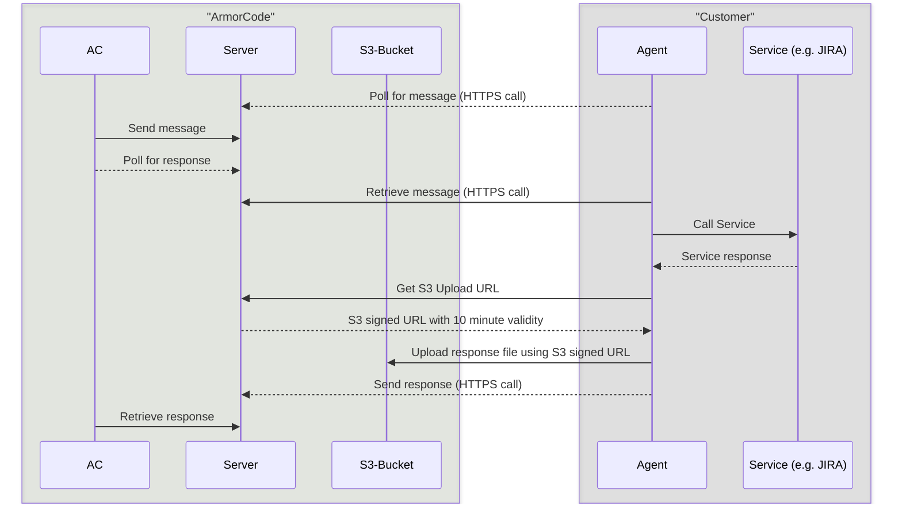

The purpose of this agent is to allow API invocation from ArmorCode to customer's on-prem service.

The architecture enables controlled, secure message exchange between the Agent, the ArmorCode platform, and customer's on-prem services. The interactions occur through secure authenticated channels.

## Authentication/Security Aspects:

a) The Agent is a short and simple open-source python script created by ArmorCode.
b) It communicates with Server using HTTPS. Agent authenticates with Server using API-key, generated out-of-band by customer from ArmorCode platform.
c) Agent to on-prem Service (e.g. JIRA, Coverity, etc) is over HTTPS
d) Agent communication with AWS S3 web-service is over HTTPS using pre-signed URL (received from Server) with validity of 10 minutes. The S3 bucket is a private bucket hosted in ArmorCode account.

## How It Works (Step-by-Step):

a) Message Retrieval: The Agent polls the Server over HTTPS. The Server checks authentication tokens and retrieves queued instructions from ArmorCode service. Once authenticated, the Agent receives the message intended for it.

b) Service Call: The Agent unpacks the response from server to get the API details (URL, HTTP Method e.g. GET/POST, headers, payload) and makes the call to the on-prem service.

c) Uploading Results: The Agent checks the response size received from on-prem service.
    - If the response is > than 100KB, it makes a call to server to get a temporary pre-signed S3 URL (HTTPS with validity of 10 minutes) to upload the file. Agent then uploads the file to via S3 URL.
    - If the response is <= than 100KB, it makes a call to server with the payload.

d) Response Delivery: The Agent sends a confirmation and reference to the uploaded data back to the Server over HTTPS. AC later retrieves the processed response from the Server. At each step, time-bound tokens, encryption in transit, and restricted privileges keep the system secure.




## Setting up the Agent just using the Agent Script (preferred)
Steps for customer
1. install requirements:  
   ```commandline
   wget -O requirements.txt 'https://raw.githubusercontent.com/armor-code/agent/refs/heads/main/web-agent/requirements.txt'; pip3 install -r requirements. txt
   ```
2. Download the script:
   ```commandline
   wget -O worker.py 'https://raw.githubusercontent.com/armor-code/agent/refs/heads/main/web-agent/app/worker.py'
   ```

3. Run command: 
   ```commandline
   python3 worker.py --serverUrl 'https://app.armorcode.com' --apiKey `<apiKey>` --index 0 --timeout 25 --verify False
    ```
4. If it is required to use proxy configs for http and https calls, you can set env variable as (if this is not configured already)
   ```commandline
   export HTTP_PROXY="<your_http_proxy_value>"
   export HTTPS_PROXY="<your_https_proxy_value>"
   ```

5. Check logs: 
    ```commandline
    cd /tmp/armorcode/log ; tail -F *
   ```


## Setting up the Agent with Docker
This is a docker image which can run on any OS supporting docker containers.

1. Generate apiKey from Armorcode Platform
2. Download the latest Agent Image
```commandline
docker pull armorcode/armorcode-web-agent
```
3. Get Server Url of the Armorcode
4. Create a folder/volume to store Api logs 
5. Run the docker Image as 
```commandline
docker run -d -e server_url='<server_url>' -e api_key='<api_key>'  -v <folder/volume>:/tmp/armorcode armorcode/armorcode-web-agent
```
6. If you don't want to do certificates validations (needed in case if VM don't have any certificates assigned and making https request) pass env variable
```commandline
docker run -d -e server_url='<server_url>' -e api_key='<api_key>' -e verify=False  -v <folder/volume>:/tmp/armorcode armorcode/armorcode-web-agent
```
7. If you have HTTP/HTTPS proxy configs enabled in the VM, those configs should be passed to docker container via env variables . ex ##
```commandline
docker run -d -e server_url='<server_url>' -e api_key='<api_key>' -e verify=False -e HTTP_PROXY=<http_proxy_url>  -e HTTPS_PROXY=<https_proxy_url>  -v <folder/volume>:/tmp/armorcode armorcode/armorcode-web-agent
```
