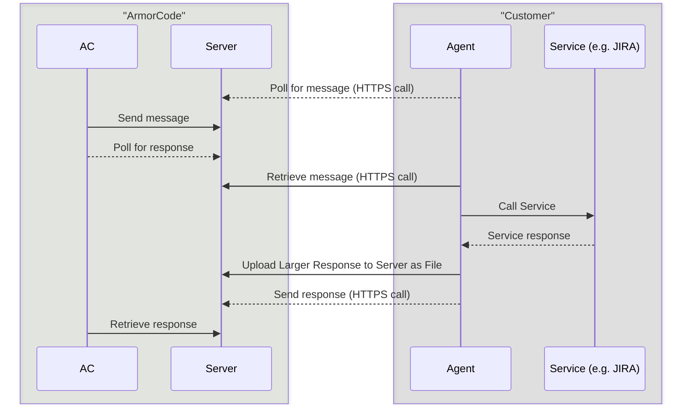

# ArmorCode Web Agent

## Overview

The ArmorCode Web Agent enables secure API invocation from the ArmorCode platform to a customer's on-premises service.
This agent facilitates controlled, secure message exchanges between:
- The ArmorCode platform
- The customer's on-premises services (e.g., JIRA, Coverity)

All interactions occur over **secure, authenticated channels** to maintain integrity and confidentiality.


## Authentication & Security Aspects

The agent follows strict authentication and security mechanisms:
1. **Open-Source & Lightweight**
- The agent is a lightweight, open-source Python script developed by ArmorCode.
2. **Secure Communication**
- The agent communicates with the **ArmorCode server via HTTPS**.
- It authenticates using an API key, which is generated by the customer via the ArmorCode platform.
3. **On-Prem Service Communication**
- API requests to on-prem services (e.g., JIRA, Coverity) occur over HTTPS.
  ## How It Works


The ArmorCode Web Agent follows a step-by-step process for executing API requests securely:

1. **Message Retrieval**
- The agent polls the ArmorCode server over HTTPS.
- The server verifies authentication tokens and retrieves any pending instructions.
- Upon successful authentication, the agent receives the message.

2. **Service Invocation**
- The agent extracts API details from the received message (e.g., URL, HTTP method, headers, payload).
- It then makes the API call to the on-prem service.

3. **Uploading Results**
- The agent evaluates the response size:
    - If the response exceeds **500KB**, it is uploaded to the ArmorCode server as a **file**.
    - If the response is **≤ 500KB**, the agent sends the data directly to the **ArmorCode server**.

4. **Response Delivery**
- The agent sends a confirmation and reference to the uploaded data back to the **ArmorCode server**.
- **ArmorCode** retrieves and processes the response.
- Throughout this process, **encryption in transit, time-bound tokens, and restricted privileges** ensure security.



## Agent can be set up using the following methods:
1. **Docker**
2. **Python Script**

## 1. Setting up the Agent with Docker
The **ArmorCode Web Agent** is available as a **Docker image** and can be deployed on any OS that supports Docker containers.

## Steps to Set Up:
1. **Generate an API Key**
   From the **ArmorCode** platform:
- **API key type:** API
- **Product:** All
- **Role:** Admin [Only the Admin can create this API Key.]

2. **Download the latest Agent Image**
```commandline
docker pull armorcode/armorcode-web-agent
```
3. **Get ArmorCode Server Url**
4. **Create a volume to store Api logs**
```commandline
docker volume create mydata
```
5. **Run the docker Image with serverURL and api key as arguments**
```commandline
docker run -d -v <volume>:/tmp/armorcode armorcode/armorcode-web-agent --serverUrl='https://web-agent.armorcode.com' --apiKey='<api_key>' 
```
**Additional Configuration:**

6. **If you have HTTPS proxy to make calls to ArmorCode API, add this argument. ex ##**
```commandline
  --outgoingProxyHttps='<https_proxy_to_access_armorcode>'
```
7. **If you have HTTPS/HTTP proxy to make calls to Internal tools, add this argument. ex ##**
```commandline
  --inwardProxyHttps='<https_proxy_to_access_internal_tools>' --inwardProxyHttp='<http_proxy_to_access_internal_tools>'
```
8. **If the Agent being deployed is for certain env(Check in Armorcode Agent In Integration Page, if Service url is configured with evnName) pass envName as command line argument**
```commandline
  --envName='<envName>'
```


## 2. Setting Up the Agent Using the Python Script
Alternatively, customers can set up the agent using a standalone Python script.

1. **Install Dependencies:**
```commandline
  wget -O requirements.txt 'https://raw.githubusercontent.com/armor-code/agent/refs/heads/main/web-agent/requirements.txt'; pip3 install -r requirements.txt
```
2. **Download the Script:**
```commandline
  wget -O worker.py 'https://raw.githubusercontent.com/armor-code/agent/refs/heads/main/web-agent/app/worker.py'
```

3. **Run Command:**
```commandline
  python3 worker.py --serverUrl='https://web-agent.armorcode.com' --apiKey=`<apiKey>`
```
**Additional Configuration:**

4. **If you have HTTPS proxy to make calls to ArmorCode API, add this argument. ex ##**
```commandline
  --outgoingProxyHttps='<https_proxy_to_access_armorcode>'
```

5. **If you have HTTPS/HTTP proxy to make calls to Internal tools, add this argument. ex ##**
```commandline
  --inwardProxyHttps='<https_proxy_to_access_internal_tools>' --inwardProxyHttp='<http_proxy_to_access_internal_tools>'
```
6. **If the Agent being deployed is for certain env(Check in Armorcode Agent In Integration Page, if Service url is configured with evnName) pass envName as command line argument**
```commandline
  --envName='<envName>'
```
### Checking Logs
To check logs, run:

```commandline
  cd /tmp/armorcode/log ; tail -F *
```