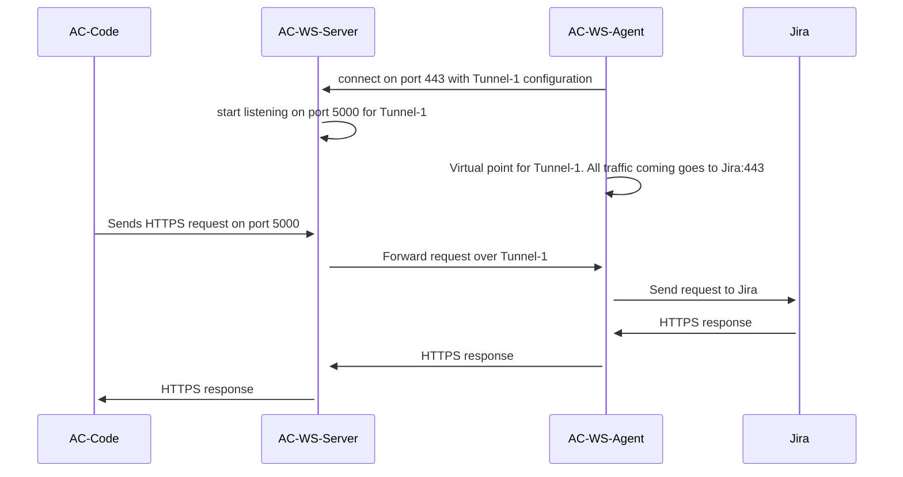

## Authentication and Security aspects

a) Authentication between WS-Agent and Armorcode WS-Server is done using token + port combination.

b) Connectivity from the agent to internal services in customer's datacenter is governed by the docker containers launched as reverse tunnel clients. There is no extra security configuration required. Customers may want to restrict internal services which Agent can access via firewall as per their security/compliance policy.

c) The docker image can be hosted in a VM or K8 cluster as per convenience. The only expectation is that Agent is able to reach armorcode service on port 443 to establish websocket connection and Agent should be able to reach the tunnel service (e.g. Jira).


## How it works
Armorcode WS-Agent uses the concept of Reverse WebSocket tunneling to establish connectivity from Armorcode Platform to customer's on-prem tools/services.

This is a similar to reverse SSH tunnel concept. Below is a short explanation of the same.

Let's assume, customer is running JIRA service in internal network and Armorcode has to connect to this JIRA service via Armorcode WS-Agent. It requires following steps

1) Customer starts the WS-Agent in their on-prem environment from where JIRA service is reachable.

2) WS-Agent creates a TCP connection to port 443 of Armorcode WS-Server (Websocket connection).

3) Due to reverse tunnel configuration, port 5000 opens-up for listening on the Armorcode WS-Server (internal network only) and any traffic sent to this port will reach the JIRA service in customer environment.

4) Armorcode platform now initiates connection to customer's JIRA service by making a connection to this port 5000. This connection is tunneled via the Armorcode WS-Server via WS-Agent to customer's JIRA.

Same is illustrated with a sequence diagram


## Setting up the Agent
This is a docker image which can run on any OS supporting docker containers.

1. Check connectivity to reverse tunnel server: 
```
curl -k https://{{server-IP/domain}}
```
2. Run reverse tunnel client:
```
docker run -d --name=armorcode-ws-agent --restart always -e TUNNEL_PORT={{tunnel-port-on-server}} -e CLIENT_SIDE_DOMAIN={{client-side-domain}} -e CLIENT_SIDE_PORT={{client-side-port}} -e SERVER_IP_DOMAIN={{server-IP/domain}} -e CLIENT_UUID={{client-uuid}} public.ecr.aws/g3l8r8c1/armorcode-ws-agent:latest
```

## Issues and their solution

1. Unable to connect with armorcode WS-Server on port 443 from docker container

   **Solution:** Work with your IT team to allow outgoing connection to armorcode server on port 443

2. Docker container exiting

   **Solution:** Check you have supplied all the variables correctly for TUNNEL_PORT, SERVER_IP_DOMAIN and CLIENT_UUID. Additionally, ensure that you are not using the same TUNNEL_PORT again for a different service.